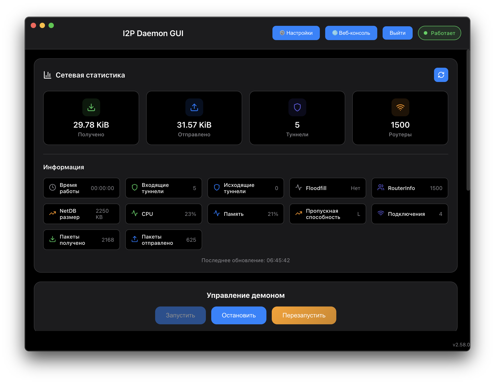
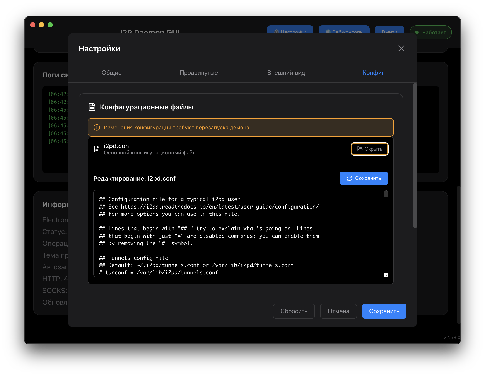

# 🚀 I2P Daemon GUI - Linux Support

<div align="center">


**Кроссплатформенный GUI для управления I2P Daemon с полной поддержкой Linux**

[](https://github.com/MetanoicArmor/i2pd-react/releases/tag/v1.1.1-linux)
[](https://github.com/MetanoicArmor/i2pd-react)

</div>

---

## 🎯 О проекте

**I2P Daemon GUI** - это современное веб-приложение на React с Electron, предоставляющее удобный графический интерфейс для управления I2P демоном. Проект теперь включает **полную поддержку Linux** с автоматическим определением операционной системы и умными путями конфигурации.

### ✨ Ключевые особенности

- 🐧 **Полная поддержка Linux** - автоматическое определение ОС и настройка путей
- 🎨 **Современный UI** - красивый интерфейс на React с темной темой
- ⚡ **Быстрый запуск** - AppImage готов к использованию без установки
- 🔧 **Умная конфигурация** - автоматическая настройка для каждой ОС
- 🌐 **Веб-консоль** - полный доступ к функциям I2P демона
- 📊 **Мониторинг** - статистика сети и туннелей в реальном времени

---

## 🚀 Быстрый старт

### Скачать и запустить

1. **Скачать AppImage**:
   ```bash
   wget https://github.com/MetanoicArmor/i2pd-react/releases/download/v1.1.1-linux/I2P\ Daemon\ GUI-1.1.0.AppImage
   ```

2. **Сделать исполняемым** (ВАЖНО!):
   ```bash
   chmod +x "I2P Daemon GUI-1.1.0.AppImage"
   ```
   > ⚠️ **КРИТИЧЕСКИ ВАЖНО!** Без этого шага AppImage не запустится!
   > Подробнее: [IMPORTANT_REMINDERS.md](IMPORTANT_REMINDERS.md)

3. **Запустить**:
   ```bash
   ./I2P\ Daemon\ GUI-1.1.0.AppImage
   ```

### Разработка

```bash
# Клонировать репозиторий
git clone https://github.com/MetanoicArmor/i2pd-react.git
cd i2pd-react

# Установить зависимости
npm install

# Запустить в режиме разработки
npm run electron-dev
```

---

## 📦 Сборка

### Linux AppImage

```bash
# Собрать AppImage для Linux
npm run dist-linux
```

### Автоматическая проверка ОС

Проект включает автоматическую проверку операционной системы перед сборкой:

```bash
# Проверка ОС (выполняется автоматически)
node pre-build-check.js
```

---

## 🔧 Технические детали

### Архитектура

- **Frontend**: React 18 + Styled Components
- **Backend**: Electron 27
- **I2P Daemon**: Встроенный исполняемый файл для Linux
- **Конфигурация**: Автоматическое определение путей

### Поддерживаемые платформы

| Платформа | Статус | Исполняемый файл | Конфиг |
|-----------|--------|------------------|--------|
| Linux x64 | ✅ Готов | `Lin/i2pd` | `~/.i2pd/` |

### Структура проекта

```
i2pd-react/
├── src/                    # React приложение
├── public/                 # Electron main process
├── Lin/                    # Linux исполняемые файлы
│   └── i2pd               # I2P демон для Linux
├── dist/                   # Собранные приложения
│   └── I2P Daemon GUI-1.1.0.AppImage
├── pre-build-check.js      # Проверка ОС
├── platform-info.json      # Информация о платформе
└── i2pd.conf              # Конфигурация I2P
```

---

## 🎨 Скриншоты

<div align="center">

### Главное окно


### Статистика сети


### Управление туннелями


### Настройки


</div>

---

## 📋 Возможности

### 🎛️ Управление демоном
- ✅ Запуск/остановка I2P демона
- ✅ Мониторинг статуса в реальном времени
- ✅ Автоматический перезапуск при сбоях
- ✅ Логирование всех операций

### 🌐 Сетевые функции
- ✅ Статистика трафика (входящий/исходящий)
- ✅ Информация о пирах и роутерах
- ✅ Мониторинг туннелей
- ✅ Управление транспортами

### 🔧 Конфигурация
- ✅ Редактор конфигурационных файлов
- ✅ Управление туннелями
- ✅ Настройки прокси
- ✅ Управление сертификатами

### 🎨 Интерфейс
- ✅ Темная тема
- ✅ Адаптивный дизайн
- ✅ Многоязычная поддержка (RU/EN)
- ✅ Системный трей

---

## 🛠️ Разработка

### Требования

- Node.js 16+
- npm 8+
- Git

### Команды

```bash
# Установка зависимостей
npm install

# Запуск в режиме разработки
npm start                    # React dev server
npm run electron-dev        # Electron app

# Сборка
npm run build               # React build
npm run dist-linux         # Linux AppImage

# Тестирование
npm test                    # Jest tests
```

### Структура кода

- `src/` - React компоненты и логика
- `public/electron.js` - Electron main process
- `src/hooks/` - React hooks для I2P API
- `src/components/` - UI компоненты
- `src/services/` - Сервисы для работы с демоном

---

## 📄 Лицензия

MIT License - см. [LICENSE](LICENSE)

---

## 🤝 Вклад в проект

1. Fork репозитория
2. Создать feature branch (`git checkout -b feature/amazing-feature`)
3. Commit изменения (`git commit -m 'Add amazing feature'`)
4. Push в branch (`git push origin feature/amazing-feature`)
5. Создать Pull Request

---

## 📞 Поддержка

- 🐛 **Баги**: [Issues](https://github.com/MetanoicArmor/i2pd-react/issues)
- 💡 **Предложения**: [Discussions](https://github.com/MetanoicArmor/i2pd-react/discussions)
- 📧 **Контакты**: [GitHub Profile](https://github.com/MetanoicArmor)

---

<div align="center">

**Сделано с ❤️ для сообщества I2P**

[](https://github.com/MetanoicArmor/i2pd-react/stargazers)
[](https://github.com/MetanoicArmor/i2pd-react/network/members)

</div>