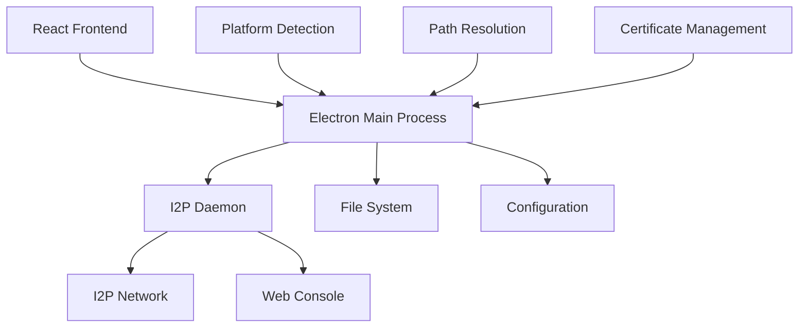

# 🔧 Техническая документация

<div align="center">


**Техническая документация и архитектура проекта**

</div>

---

## 🏗️ Архитектура

### 📊 Общая схема



### 🔧 Компоненты

| Компонент | Технология | Описание |
|-----------|------------|----------|
| **Frontend** | React 18 + Styled Components | Современный UI с темной темой |
| **Backend** | Electron 27 | Кроссплатформенная оболочка |
| **I2P Daemon** | C++ Binary | Встроенный исполняемый файл |
| **Configuration** | JSON + INI | Умная система конфигурации |
| **Platform Detection** | Node.js | Автоматическое определение ОС |

---

## 📁 Структура проекта

```
i2pd-react/
├── 📁 src/                          # React приложение
│   ├── 📁 components/               # UI компоненты
│   │   ├── 📄 StatusCard.js        # Карточка статуса
│   │   ├── 📄 NetworkStats.js      # Статистика сети
│   │   ├── 📄 ControlButtons.js    # Кнопки управления
│   │   └── 📄 SettingsModal.js     # Модальное окно настроек
│   ├── 📁 hooks/                   # React hooks
│   │   ├── 📄 useI2pdManager.js    # Управление демоном
│   │   ├── 📄 useNetworkInfo.js    # Информация о сети
│   │   └── 📄 useSettings.js       # Настройки приложения
│   ├── 📁 services/                # Сервисы
│   │   └── 📄 NetworkStatsService.js
│   └── 📄 App.js                   # Главный компонент
├── 📁 public/                       # Electron main process
│   ├── 📄 electron.js              # Главный процесс Electron
│   ├── 📄 preload.js               # Preload скрипт
│   └── 📄 index.html               # HTML шаблон
├── 📁 Lin/                         # Linux исполняемые файлы
│   └── 📄 i2pd                    # I2P демон для Linux (93MB)
├── 📁 dist/                        # Собранные приложения
│   └── 📄 I2P Daemon GUI-1.1.0.AppImage
├── 📄 pre-build-check.js           # Проверка ОС перед сборкой
├── 📄 platform-info.json           # Информация о платформе
├── 📄 i2pd.conf                   # Конфигурация I2P
└── 📄 package.json                # Зависимости и скрипты
```

---

## ⚙️ Система конфигурации

### 🔍 Автоматическое определение ОС

```javascript
// pre-build-check.js
const configPaths = {
  'linux': path.join(os.homedir(), '.i2pd'),
  'darwin': path.join(os.homedir(), 'Library', 'Application Support', 'i2pd'),
  'win32': path.join(os.homedir(), 'AppData', 'Roaming', 'i2pd')
};
```

### 📁 Умные пути

```javascript
// electron.js - getI2pdConfigDir()
function getI2pdConfigDir() {
  // Загружаем информацию о платформе
  let platformInfo = null;
  try {
    const platformInfoPath = path.join(__dirname, '..', 'platform-info.json');
    if (fs.existsSync(platformInfoPath)) {
      platformInfo = JSON.parse(fs.readFileSync(platformInfoPath, 'utf8'));
    }
  } catch (error) {
    console.log('⚠️ Не удалось загрузить platform-info.json');
  }
  
  // Используем информацию из файла или стандартную логику
  if (platformInfo && platformInfo.configPath) {
    return platformInfo.configPath;
  }
  
  // Стандартная логика для каждой ОС
  switch (process.platform) {
    case 'linux': return path.join(os.homedir(), '.i2pd');
    case 'darwin': return path.join(os.homedir(), 'Library', 'Application Support', 'i2pd');
    case 'win32': return path.join(os.homedir(), 'AppData', 'Roaming', 'i2pd');
    default: return path.join(os.homedir(), '.i2pd');
  }
}
```

---

## 🔌 IPC Communication

### 📡 Каналы связи

| Канал | Описание | Параметры |
|-------|----------|-----------|
| `start-daemon` | Запуск демона | - |
| `stop-daemon` | Остановка демона | - |
| `check-daemon-status` | Проверка статуса | - |
| `get-daemon-version` | Получение версии | - |
| `get-daemon-network-info` | Информация о сети | - |
| `get-daemon-stats` | Статистика демона | - |
| `open-web-console` | Открытие веб-консоли | - |
| `read-config-file` | Чтение конфига | `fileName` |
| `write-config-file` | Запись конфига | `fileName`, `content` |

### 🔄 Пример использования

```javascript
// React компонент
const { startDaemon, stopDaemon, getStatus } = useI2pdManager();

// Запуск демона
const handleStart = async () => {
  const result = await startDaemon();
  if (result.success) {
    console.log('Демон запущен');
  }
};

// Получение статуса
const status = await getStatus();
console.log('Статус:', status.isRunning);
```

---

## 🐧 Linux-специфичные особенности

### 📂 Структура файлов

```
~/.i2pd/
├── 📄 i2pd.conf              # Основная конфигурация
├── 📄 i2pd.log              # Логи демона
├── 📄 i2pd.pid              # PID файл
├── 📄 router.keys           # Ключи роутера
├── 📄 router.info           # Информация о роутере
├── 📁 certificates/         # Сертификаты
│   ├── 📁 family/          # Семейные сертификаты
│   └── 📁 reseed/          # Сертификаты для reseed
├── 📁 netDb/               # База данных сети
├── 📁 peerProfiles/        # Профили пиров
└── 📁 addressbook/        # Адресная книга
```

### 🔐 Управление сертификатами

```javascript
// Автоматическое копирование сертификатов
async function initializeI2pdConfig() {
  const configDir = getI2pdConfigDir();
  
  if (process.platform === 'linux') {
    // Создаем директорию конфигов
    if (!fs.existsSync(configDir)) {
      fs.mkdirSync(configDir, { recursive: true });
    }
    
    // Копируем сертификаты из системной директории
    const systemCerts = '/var/lib/i2pd/certificates';
    const localCerts = path.join(configDir, 'certificates');
    
    if (fs.existsSync(systemCerts)) {
      exec(`sudo cp -r ${systemCerts}/* ${localCerts}/`);
    }
  }
}
```

### 🚀 Запуск демона

```javascript
// Запуск с правильными параметрами
daemonProcess = spawn(executablePath, [
  `--conf=${configPath}`, 
  '--daemon'
], {
  detached: true,
  stdio: 'ignore',
  uid: process.getuid ? process.getuid() : undefined,
  gid: process.getgid ? process.getgid() : undefined
});
```

---

## 📊 Мониторинг и логирование

### 📝 Система логов

```javascript
// Логирование в electron.js
console.log('🔧 IPC: start-daemon invoked');
console.log('📁 Используем путь из platform-info.json:', configPath);
console.log('✅ Демон запущен успешно');
console.error('❌ Ошибка запуска демона:', error.message);
```

### 📈 Мониторинг статуса

```javascript
// Проверка статуса демона
async function checkDaemonStatusInternal() {
  const executablePath = findI2pdExecutable();
  const configPath = path.join(getI2pdConfigDir(), 'i2pd.conf');
  
  return new Promise((resolve) => {
    exec(`ps aux | grep 'i2pd.*--conf.*${configPath}' | grep -v grep`, 
      (error, stdout) => {
        if (stdout.trim()) {
          resolve({ success: true, isRunning: true });
        } else {
          resolve({ success: true, isRunning: false });
        }
      }
    );
  });
}
```

---

## 🔧 Сборка и развертывание

### 📦 Процесс сборки

```bash
# 1. Проверка ОС
npm run prebuild  # → pre-build-check.js

# 2. Сборка React
npm run build     # → build/

# 3. Сборка Electron
npm run dist-linux # → dist/I2P Daemon GUI-1.1.0.AppImage
```

### 🎯 AppImage структура

```
I2P Daemon GUI-1.1.0.AppImage
├── 📁 resources/
│   ├── 📁 app.asar          # React приложение
│   ├── 📁 Lin/             # Linux исполняемые файлы
│   │   └── 📄 i2pd        # I2P демон
│   └── 📄 electron.js     # Electron main process
├── 📄 AppRun               # Запуск приложения
└── 📄 *.desktop           # Desktop файл
```

---

## 🧪 Тестирование

### ✅ Проверки

```bash
# Проверка сборки
npm run build

# Проверка Electron
npm run electron-dev

# Проверка AppImage (ВАЖНО: дать права!)
chmod +x "dist/I2P Daemon GUI-1.1.0.AppImage"
./dist/I2P\ Daemon\ GUI-1.1.0.AppImage

# Проверка демона
ps aux | grep i2pd
curl http://127.0.0.1:7070/
```

> ⚠️ **ВАЖНО!** AppImage требует права на выполнение: `chmod +x`

### 🔍 Отладка

```javascript
// Включение отладочных логов
const DEBUG = process.env.NODE_ENV === 'development';

if (DEBUG) {
  console.log('🔍 Debug: Platform info loaded:', platformInfo);
  console.log('🔍 Debug: Config path:', configPath);
  console.log('🔍 Debug: Executable path:', executablePath);
}
```

---

## 📚 API Reference

### 🎛️ useI2pdManager Hook

```javascript
const {
  isRunning,        // boolean - статус демона
  version,          // string - версия демона
  networkInfo,      // object - информация о сети
  startDaemon,      // function - запуск демона
  stopDaemon,       // function - остановка демона
  restartDaemon,    // function - перезапуск демона
  getStatus,        // function - получение статуса
  openWebConsole    // function - открытие веб-консоли
} = useI2pdManager();
```

### 📊 NetworkInfo Object

```javascript
{
  isRunning: boolean,
  uptime: string,           // "00:05:23"
  peerCount: number,        // 25
  bytesReceived: number,    // 1024000
  bytesSent: number,        // 512000
  activeTunnels: number,    // 3
  routerInfos: number       // 150
}
```

---

<div align="center">

**🔧 Техническая документация готова!**

[](https://github.com/MetanoicArmor/i2pd-react)
[](https://github.com/MetanoicArmor/i2pd-react)

</div>
